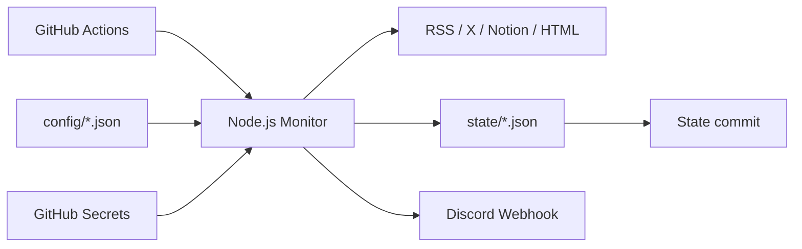

# Triple Monitor System

GitHub Actions 上で RSS、X profile、Notion、公開 HTML 一覧を定期監視し、新着や更新を Discord webhook へ通知する監視基盤です。

実行環境は Node.js 24 LTS 前提です。GitHub Actions でも `actions/setup-node@v6` で Node 24 を明示しています。

利用者は、監視対象サービス、RSSHub、GitHub Actions、Discord、Notion、X などの利用規約と適用法令を確認し、許可された範囲でこのリポジトリを利用してください。

## 全体像



## できること

| 種類           | 用途                                   | 主な workflow             |
| -------------- | -------------------------------------- | ------------------------- |
| RSS / Atom     | feed の新着監視                        | `rss-monitor.yml`         |
| X/Twitter RSS  | RSSHub 経由の X/Twitter feed 監視      | `x-twitter-monitor.yml`   |
| X profile      | 本人投稿や RT の profile polling       | `x-profile-monitor.yml`   |
| Notion         | page / database の更新監視             | `notion-monitor.yml`      |
| 公開 HTML 一覧 | イベント一覧やニュース一覧の新着監視   | `public-site-monitor.yml` |
| Tourism set    | 観光イベント系 source の追加監視セット | `tourism-monitor.yml`     |

## 最短セットアップ

1. Node.js 24 を用意します。
2. 依存関係をインストールします。

```bash
npm ci --ignore-scripts
```

3. `config/default-sources.json` または `config/tourism-sources.json` を編集し、使う source の `enabled` を `true` にします。
4. GitHub リポジトリの `Settings > Secrets and variables > Actions` に必要な Secrets を登録します。

```text
DISCORD_WEBHOOK_URL_MAIN
DISCORD_WEBHOOK_URL_TOURISM
NOTION_TOKEN_MAIN
TWITTER_AUTH_TOKEN
```

5. GitHub Actions の `workflow_dispatch` または schedule で監視を実行します。

## ドキュメント

| ドキュメント                                   | 内容                                   |
| ---------------------------------------------- | -------------------------------------- |
| [概要](docs/01-overview.md)                    | システムの目的、監視セット、重要ルール |
| [運用手順](docs/02-operations.md)              | 日常確認、手動実行、失敗時の一次対応   |
| [設定変更](docs/03-configuration.md)           | source 追加、環境変数、Secrets、設定例 |
| [設計](docs/04-architecture.md)                | 実装構造、処理フロー、state 更新ルール |
| [トラブルシュート](docs/05-troubleshooting.md) | よくあるエラーと確認ポイント           |
| [図一覧](docs/diagrams.md)                     | Mermaid 図のまとめ                     |

## よく使うコマンド

```bash
npm run build
npm run validate:config
npm run test:coverage
npm run check
```

個別監視をローカルで動かす場合は、必要な環境変数を設定してから実行します。

```bash
npm run monitor:rss:standard
npm run monitor:x-profile
npm run monitor:notion
npm run monitor:public-html
npm run monitor:tourism
```

## リポジトリ構成

```text
.
├─ .github/
│  ├─ actions/commit-monitor-state/
│  └─ workflows/
├─ config/
├─ docs/
├─ src/
├─ state/
├─ tests/
├─ package.json
└─ README.md
```

## 重要な運用ルール

- 初回実行では既存記事を通知せず、現在位置だけを state に保存します。
- Discord 通知に成功した item / version だけ state を進めます。
- 1 source が失敗しても他 source の監視は継続します。
- token、webhook URL、認証情報は GitHub Secrets に置き、config へ直接書きません。
- HTML 一覧の抽出は `selector-strategies.ts` の許可済み strategy だけで行います。
