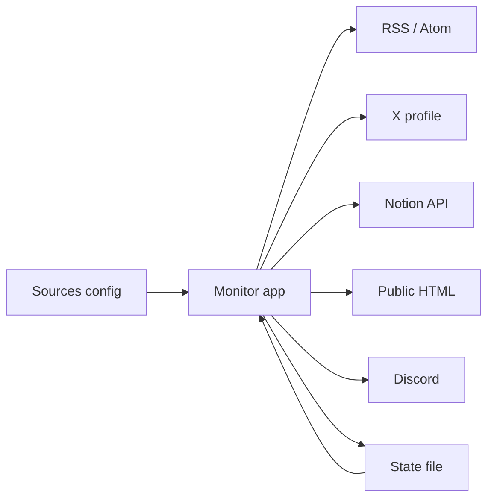
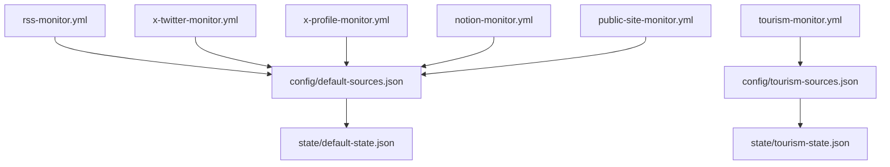

# 概要

Triple Monitor System は、複数種類の監視を同じ state 形式と通知処理で扱う GitHub Actions ベースの監視基盤です。

## 監視対象

| type                       | 監視内容           | 差分の単位         |
| -------------------------- | ------------------ | ------------------ |
| `rss`                      | RSS / Atom feed    | item ID            |
| `x_profile_poll`           | X profile timeline | status ID          |
| `notion_api_page_poll`     | Notion page        | `last_edited_time` |
| `notion_api_database_poll` | Notion database    | `last_edited_time` |
| `public_html_list_poll`    | 公開 HTML 一覧     | item ID            |

## 監視セット

| 監視セット  | sources                       | state                      | 主な用途                  |
| ----------- | ----------------------------- | -------------------------- | ------------------------- |
| 既定セット  | `config/default-sources.json` | `state/default-state.json` | RSS、X、Notion、一般 HTML |
| Tourism set | `config/tourism-sources.json` | `state/tourism-state.json` | 観光イベント系 HTML       |

## 重要ルール

- 初回実行は通知せず、現在位置だけを state に保存します。
- 2 回目以降は差分だけ通知します。
- Discord 通知に成功した item / version だけ state を進めます。
- 1 source が失敗しても他 source の監視は継続します。
- workflow ごとに `MONITOR_SOURCES_PATH` と `MONITOR_STATE_PATH` を明示します。

## Secrets

| Secret                        | 用途                        |
| ----------------------------- | --------------------------- |
| `DISCORD_WEBHOOK_URL_MAIN`    | 既定セットの Discord 通知   |
| `DISCORD_WEBHOOK_URL_TOURISM` | Tourism set の Discord 通知 |
| `NOTION_TOKEN_MAIN`           | Notion API                  |
| `TWITTER_AUTH_TOKEN`          | X profile / RSSHub X route  |

## 公開時の注意

token、webhook URL、cookie、認証値は GitHub Secrets に保存し、`config/*.json` には環境変数名だけを書きます。監視対象サービスの利用規約と適用法令を確認し、許可された範囲で運用してください。
