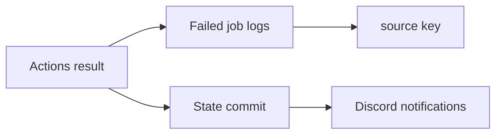
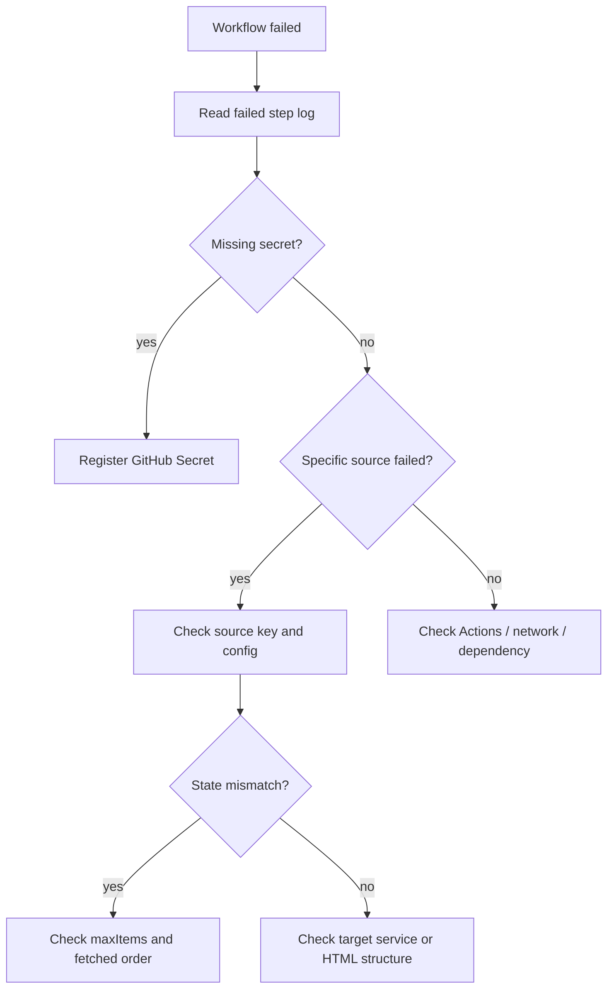

# 運用手順

このページは、日常運用と失敗時の一次対応だけを扱います。

## 日常確認



| 確認先         | 見るもの                                  |
| -------------- | ----------------------------------------- |
| GitHub Actions | workflow の成功 / 失敗                    |
| Actions log    | 失敗した source の `key` と error message |
| Git commit     | `state/*.json` が更新されているか         |
| Discord        | 想定した channel に通知されたか           |

## 手動実行

GitHub の `Actions` タブから対象 workflow を選び、`Run workflow` を実行します。

| workflow              | 用途                        | state                      |
| --------------------- | --------------------------- | -------------------------- |
| `RSS Monitor`         | 通常 RSS                    | `state/default-state.json` |
| `X Twitter Monitor`   | RSSHub 経由の X/Twitter RSS | `state/default-state.json` |
| `X Profile Monitor`   | X profile polling           | `state/default-state.json` |
| `Notion Monitor`      | Notion page / database      | `state/default-state.json` |
| `Public Site Monitor` | 公開 HTML 一覧              | `state/default-state.json` |
| `Tourism Monitor`     | 観光イベント系 HTML         | `state/tourism-state.json` |

## ローカル実行

```bash
npm ci --ignore-scripts
npm run build
npm run validate:config
```

必要な環境変数を設定してから個別監視を実行します。

```bash
npm run monitor:rss:standard
npm run monitor:x-profile
npm run monitor:notion
npm run monitor:public-html
npm run monitor:tourism
```

PowerShell では次のように設定します。

```powershell
$env:DISCORD_WEBHOOK_URL_MAIN="https://discord.com/api/webhooks/..."
$env:DISCORD_WEBHOOK_URL_TOURISM="https://discord.com/api/webhooks/..."
$env:NOTION_TOKEN_MAIN="secret_..."
$env:TWITTER_AUTH_TOKEN="..."
```

## 失敗時の確認順



1. Actions log で失敗 step を確認します。
2. `source 失敗: key=...` の `key` を確認します。
3. Secret 未設定か確認します。
4. 対象サイト、Notion、X、RSSHub の一時障害を確認します。
5. `既読 item が取得結果に見つかりません` の場合は `maxItems`、取得順、HTML 構造変更を確認します。
6. 公開 HTML の抽出失敗は `src/selector-strategies.ts` と fixture test を更新します。

## State の扱い

state は重複通知を防ぐ根拠です。理由なく削除しないでください。

| 操作                | 判断                                   |
| ------------------- | -------------------------------------- |
| state commit の確認 | 通常運用で行う                         |
| state の手編集      | 原因が明確なときだけ行う               |
| state の削除        | 大量再通知の可能性があるため原則避ける |

初回実行や state 削除後は、既存 item を通知せず baseline だけ保存します。ただし source の状態によっては次回以降の通知範囲が変わるため、削除前に運用者間で確認してください。

## 定期メンテナンス

| 項目            | 目安                                   |
| --------------- | -------------------------------------- |
| Dependabot PR   | 週次で確認                             |
| `Quality Check` | PR ごとに確認                          |
| RSSHub digest   | X/Twitter RSS が壊れたときに更新検討   |
| Secrets         | 担当変更や漏えい疑いのタイミングで更新 |
