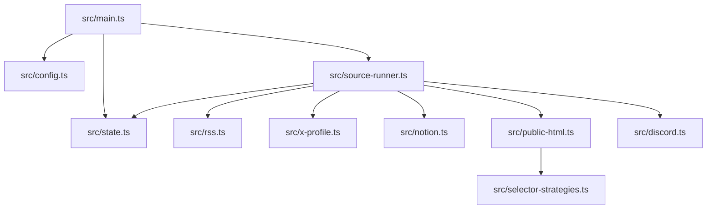
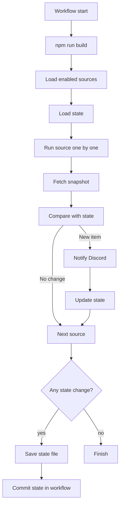
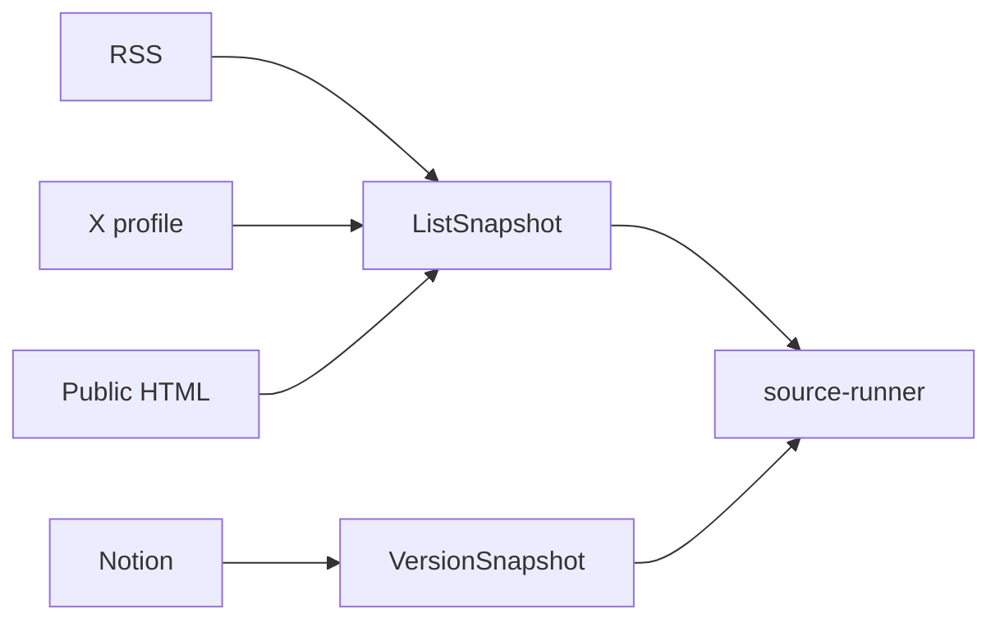
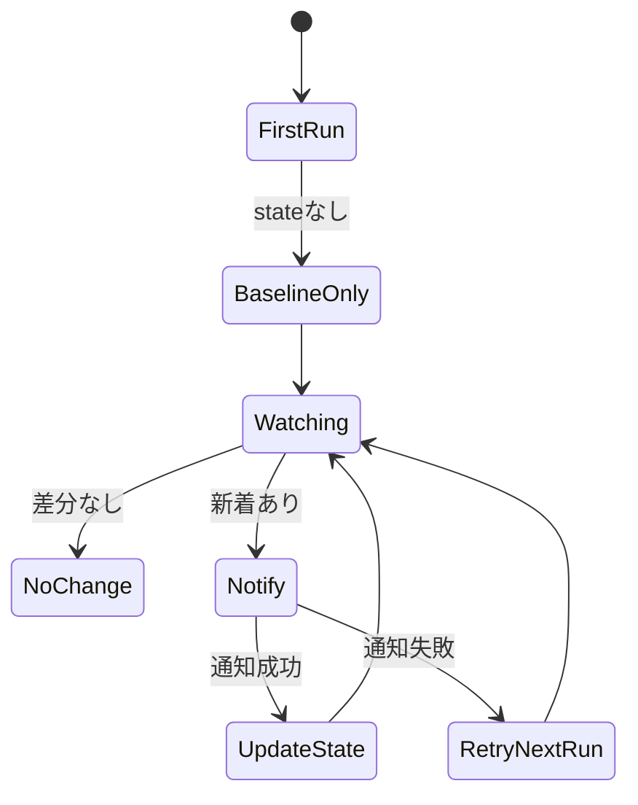
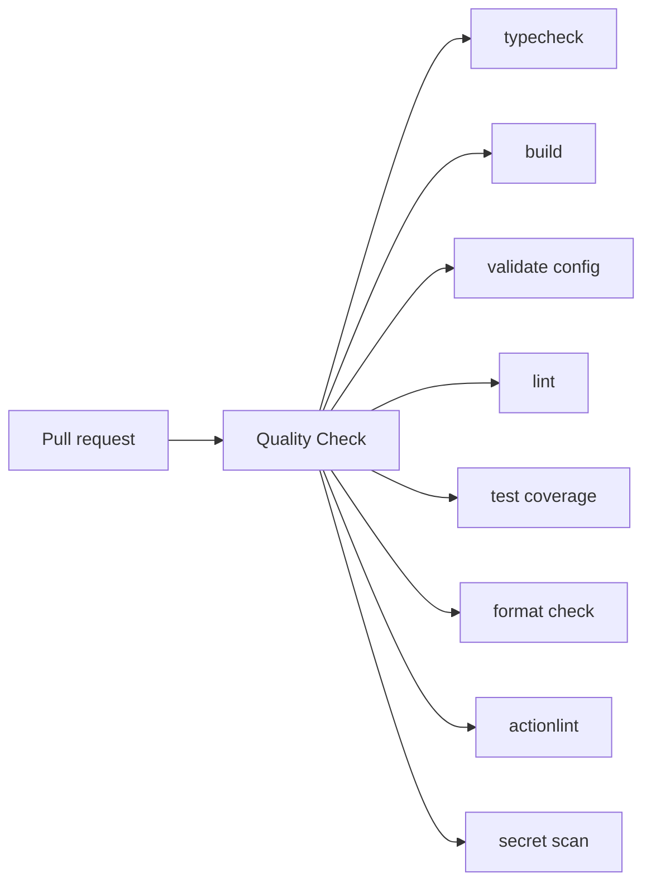

# 設計

監視タイプごとの取得処理は分け、差分判定、通知、state 更新は `source-runner.ts` に集約しています。



## モジュール責務

| ファイル                     | 責務                                    |
| ---------------------------- | --------------------------------------- |
| `src/main.ts`                | CLI 引数、source 実行、state 保存       |
| `src/config.ts`              | sources 読み込み、type / group 絞り込み |
| `src/source-runner.ts`       | 差分判定、通知、state 更新              |
| `src/rss.ts`                 | RSS / Atom 取得                         |
| `src/x-profile.ts`           | X profile 取得                          |
| `src/notion.ts`              | Notion API 取得                         |
| `src/public-html.ts`         | 公開 HTML 取得                          |
| `src/selector-strategies.ts` | HTML 抽出 strategy                      |
| `src/state.ts`               | state 読み書き                          |
| `src/discord.ts`             | Discord 通知                            |
| `src/source-validator.ts`    | source 設定の検証                       |
| `src/validate-config.ts`     | config / state の検証 CLI               |

## 処理フロー



source は直列に処理します。外部 API や公開サイトへの負荷を抑え、ログから原因を追いやすくするためです。

## Snapshot



| snapshot          | 対象                      | state                           |
| ----------------- | ------------------------- | ------------------------------- |
| `ListSnapshot`    | RSS、X profile、公開 HTML | `lastSeenItemId`, `seenItemIds` |
| `VersionSnapshot` | Notion page / database    | `lastSeenVersion`               |

## State 更新ルール



初回は大量通知を避けるため、通知せず baseline だけ保存します。2 回目以降は、通知に成功した item / version だけ state を進めます。

RSS、X profile、公開 HTML は一覧順の軽い揺れに備えて `seenItemIds` 履歴も保存します。取得結果と既読履歴が交差しない場合は、重複通知を避けるため source 失敗として扱います。

## Workflow 分割

| workflow                  | schedule   | type / group                   | state                      |
| ------------------------- | ---------- | ------------------------------ | -------------------------- |
| `rss-monitor.yml`         | 30 分ごと  | `rss` / `standard-rss`         | `state/default-state.json` |
| `x-twitter-monitor.yml`   | 30 分ごと  | `rss` / `x-twitter`            | `state/default-state.json` |
| `x-profile-monitor.yml`   | 30 分ごと  | `x_profile_poll` / `x-profile` | `state/default-state.json` |
| `notion-monitor.yml`      | 毎時 20 分 | `notion` group                 | `state/default-state.json` |
| `public-site-monitor.yml` | 毎時 25 分 | `public_html_list_poll`        | `state/default-state.json` |
| `tourism-monitor.yml`     | 毎日 6:10  | `tourism-events`               | `state/tourism-state.json` |

既定セットの workflow は `concurrency.group: default-monitor-state` を共有します。state commit の競合を避けるためです。Tourism set は別 state なので `tourism-monitor-state` を使います。

## 品質チェック



主なコマンド:

```bash
npm run typecheck
npm run build
npm run validate:config
npm run lint
npm run knip
npm run test:coverage
npm run format:check
```

まとめて確認する場合:

```bash
npm run check
```
