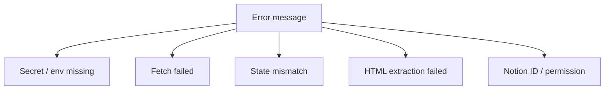
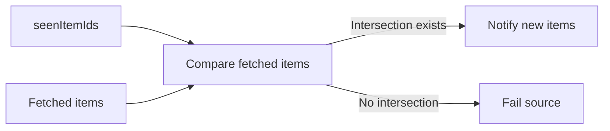

# トラブルシュート

まず GitHub Actions の失敗 step と `source 失敗: key=...` の `key` を確認します。

## よくあるエラー

| エラー                                                 | 主な原因                                   | 対応                                                          |
| ------------------------------------------------------ | ------------------------------------------ | ------------------------------------------------------------- |
| `必要な環境変数 ... が設定されていません`              | Secret 名と config の環境変数名が不一致    | `webhookEnvName`、`notionTokenEnvName`、GitHub Secrets を確認 |
| `TWITTER_AUTH_TOKEN secret is required...`             | X/Twitter 用 Secret 未設定                 | `TWITTER_AUTH_TOKEN` を GitHub Secrets に登録                 |
| `RSSHub did not become ready in time.`                 | RSSHub container 起動失敗                  | workflow 再実行、GHCR 障害、image digest を確認               |
| `HTML一覧から記事リンクを抽出できませんでした`         | 対象サイトの HTML 構造変更                 | `selector-strategies.ts` と fixture test を更新               |
| `既読 item が取得結果に見つかりません`                 | `maxItems` 不足、取得順変更、HTML 構造変更 | `maxItems`、取得 item、selector を確認                        |
| `Provided ID ... is a database, not a page`            | database ID を page 監視に指定             | `notion_api_database_poll` と `databaseId` を使う             |
| `Notion APIレスポンスに last_edited_time がありません` | ID 誤り、権限不足、API 仕様差分            | Notion integration の共有と ID を確認                         |

## X/Twitter だけ失敗する

確認順:

1. `TWITTER_AUTH_TOKEN` が GitHub Secrets に登録されているか。
2. `x-twitter-monitor.yml` の RSSHub service が起動しているか。
3. `Wait for RSSHub` step が成功しているか。
4. RSSHub image digest が古くないか。
5. 対象 route が RSSHub 側でまだ利用できるか。

X/Twitter RSS は RSSHub の route 実装に依存します。取得漏れや空 feed が続く場合は、RSSHub と対象サービス側の仕様変更を確認してください。

## 公開 HTML だけ失敗する

確認順:

1. 対象 URL をブラウザで開けるか。
2. Actions log の HTTP status を確認します。
3. fixture HTML と現在の HTML 構造を比較します。
4. `selector-strategies.ts` の対象 strategy を更新します。
5. `tests/selector-strategies.test.ts` を更新します。

HTML 監視では、外部入力の selector 文字列をそのまま使わない方針です。新しいサイトは strategy と test を追加してください。

## Notion だけ失敗する

確認順:

1. `NOTION_TOKEN_MAIN` が GitHub Secrets に登録されているか。
2. Notion integration が対象 page / database に共有されているか。
3. page ID と database ID を取り違えていないか。
4. source の `type` と `pageId` / `databaseId` が一致しているか。

## State mismatch

`既読 item が取得結果に見つかりません` は、重複通知を避けるための fail-safe です。

主な原因:

- `maxItems` が少なすぎて前回既読 item が取得範囲から落ちた。
- 対象サイトや feed の並び順が変わった。
- HTML strategy が別のリンクを拾うようになった。
- state を手編集した。

対応:

1. Actions log の `list snapshot` を確認します。
2. `sample=` に出ている item ID と state の `seenItemIds` を比較します。
3. `maxItems` を増やします。
4. HTML の場合は selector strategy を見直します。

## state を直す前の注意

state は通知済み判定の根拠です。手編集すると重複通知や通知漏れにつながります。

原則:

- Secret や URL の問題なら state は触りません。
- HTML 抽出の問題なら strategy と test を直します。
- `maxItems` 不足なら設定を増やします。
- state 手編集は原因が明確で、通知範囲を理解している場合だけ行います。
