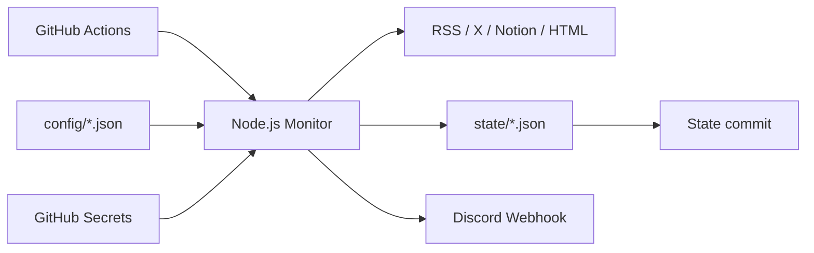
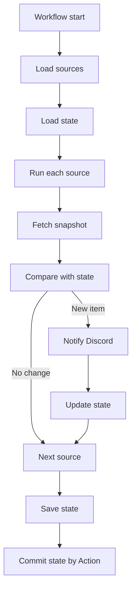
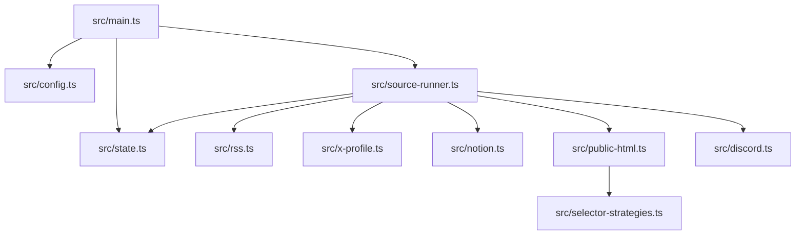
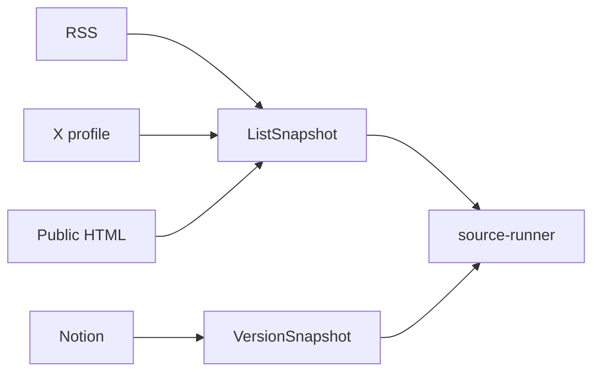
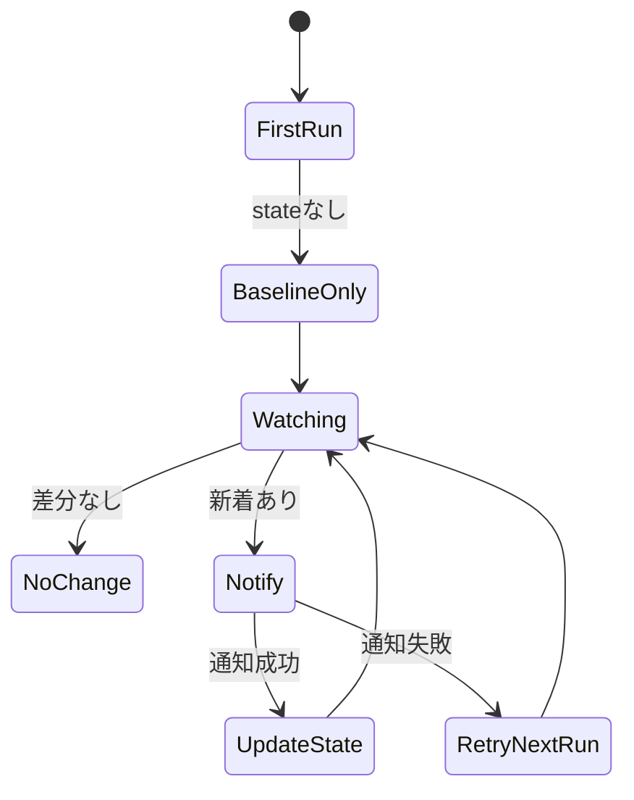
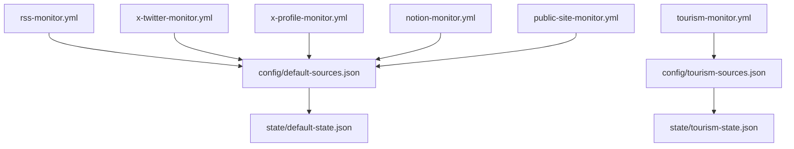
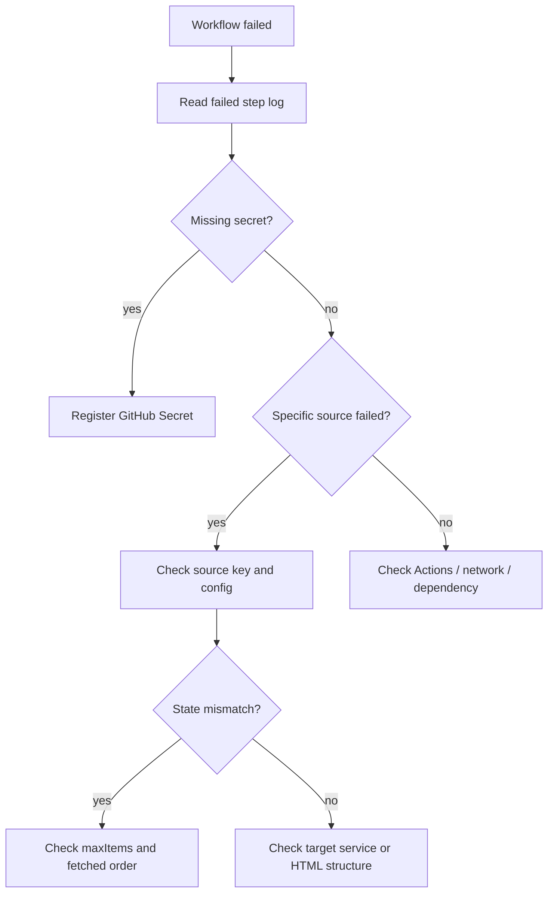

# 図一覧

ドキュメントで使う Mermaid 図のまとめです。

## 全体構成

```mermaid
flowchart LR
  Actions[GitHub Actions] --> App[Node.js Monitor]
  Config[config/*.json] --> App
  Secrets[GitHub Secrets] --> App
  App --> Sources[RSS / X / Notion / HTML]
  App --> State[state/*.json]
  App --> Discord[Discord Webhook]
  State --> Commit[State commit]
```

## 処理フロー

```mermaid
flowchart TD
  Start[Workflow start] --> LoadConfig[Load sources]
  LoadConfig --> LoadState[Load state]
  LoadState --> Loop[Run each source]
  Loop --> Fetch[Fetch snapshot]
  Fetch --> Diff[Compare with state]
  Diff -->|No change| Next[Next source]
  Diff -->|New item| Notify[Notify Discord]
  Notify --> UpdateState[Update state]
  UpdateState --> Next
  Next --> SaveState[Save state]
  SaveState --> Commit[Commit state by Action]
```

## モジュール構成

```mermaid
flowchart TB
  Main[src/main.ts] --> Config[src/config.ts]
  Main --> State[src/state.ts]
  Main --> Runner[src/source-runner.ts]
  Runner --> RSS[src/rss.ts]
  Runner --> X[src/x-profile.ts]
  Runner --> Notion[src/notion.ts]
  Runner --> HTML[src/public-html.ts]
  HTML --> Strategy[src/selector-strategies.ts]
  Runner --> Discord[src/discord.ts]
  Runner --> State
```

## Snapshot

```mermaid
flowchart LR
  RSS[RSS] --> List[ListSnapshot]
  X[X profile] --> List
  HTML[Public HTML] --> List
  Notion[Notion] --> Version[VersionSnapshot]
  List --> Runner[source-runner]
  Version --> Runner
```

## State 更新

```mermaid
stateDiagram-v2
  [*] --> FirstRun
  FirstRun --> BaselineOnly: stateなし
  BaselineOnly --> Watching
  Watching --> NoChange: 差分なし
  Watching --> Notify: 新着あり
  Notify --> UpdateState: 通知成功
  Notify --> RetryNextRun: 通知失敗
  UpdateState --> Watching
  RetryNextRun --> Watching
```

## Workflow と state

```mermaid
flowchart TB
  DefaultConfig[config/default-sources.json] --> DefaultState[state/default-state.json]
  TourismConfig[config/tourism-sources.json] --> TourismState[state/tourism-state.json]

  RSS[rss-monitor.yml] --> DefaultConfig
  XTwitter[x-twitter-monitor.yml] --> DefaultConfig
  XProfile[x-profile-monitor.yml] --> DefaultConfig
  Notion[notion-monitor.yml] --> DefaultConfig
  PublicSite[public-site-monitor.yml] --> DefaultConfig
  Tourism[tourism-monitor.yml] --> TourismConfig
```

## 障害切り分け

```mermaid
flowchart TD
  Fail[Workflow failed] --> Log[Read failed step log]
  Log --> Secret{Missing secret?}
  Secret -->|yes| FixSecret[Register GitHub Secret]
  Secret -->|no| Source{Specific source failed?}
  Source -->|yes| CheckSource[Check source key and config]
  Source -->|no| Infra[Check Actions / network / dependency]
  CheckSource --> State{State mismatch?}
  State -->|yes| CheckMaxItems[Check maxItems and fetched order]
  State -->|no| Target[Check target service or HTML structure]
```
